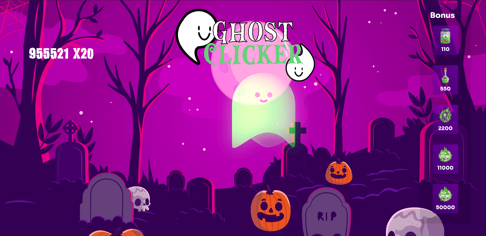

# Ghost Clicker 
<section>
 <a href="https://williamloey.github.io/Cookie-Clicker/">
  

 </section>

## Description
The game was created based on [Coockie Clicker](https://fr.wikipedia.org/wiki/Cookie_Clicker) in which we must click on the target until we have as many points as possible to buy bonus and thus generate more clicks "points", this version was used as theme of [Halloween](https://fr.wikipedia.org/wiki/Halloween) . as a way of celebrating this time of year!

* The game has a responsive design for all screen types
* It has a beautiful design with 3D animation
* Functional buttons with beautiful animations 

## How it was developed

The game was thought together by all collaborators, and was developed based on HTML with JavaScript to make it fully functional and playable, and the appearance was made in CSS/SCSS. 
We also used resources such as reference links, public images that were adapted and edited in Adobe Photoshop and Adobe XD to develop the model that served as the basis

## Collaborators 
  * [Mess Dorchies](https://github.com/MessDorchies)
  * [Romain Berthaux](https://github.com/kawtagan)
  * [Sylvain Valvassori](https://github.com/Sylvain-Valvassori)
  * [William Van Loey](https://github.com/WilliamLoey)

#### Front-end
The front-end was developed by [Romain](https://github.com/kawtagan) and [Sylvain](https://github.com/Sylvain-Valvassori) who created the HTML base of the project and elaborated the images and mock-ups of the game, making it possible to have a beautiful look without image cuts or responsiveness errors on screen 

#### Back-end
The Back-end was developed in JavaScript by [Mess](https://github.com/MessDorchies) with support from [William](https://github.com/WilliamLoey), to make the game functional and fix the errors and possible bugs.

##

### Objectives of the game
Click on the ghost as many times as possible, collect points to buy bonus and compete with your friends to see who can get the highest score possible. 

[*Visit the game*](https://williamloey.github.io/Cookie-Clicker/) 
 

* *The game can still undergo future adjustments to have more bonus and options* 
 

### *Have fun !*  
